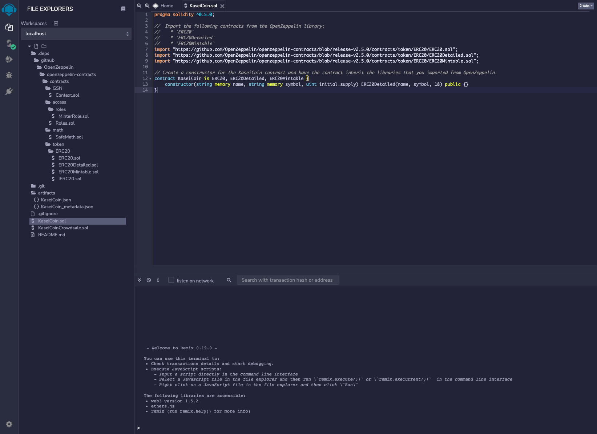
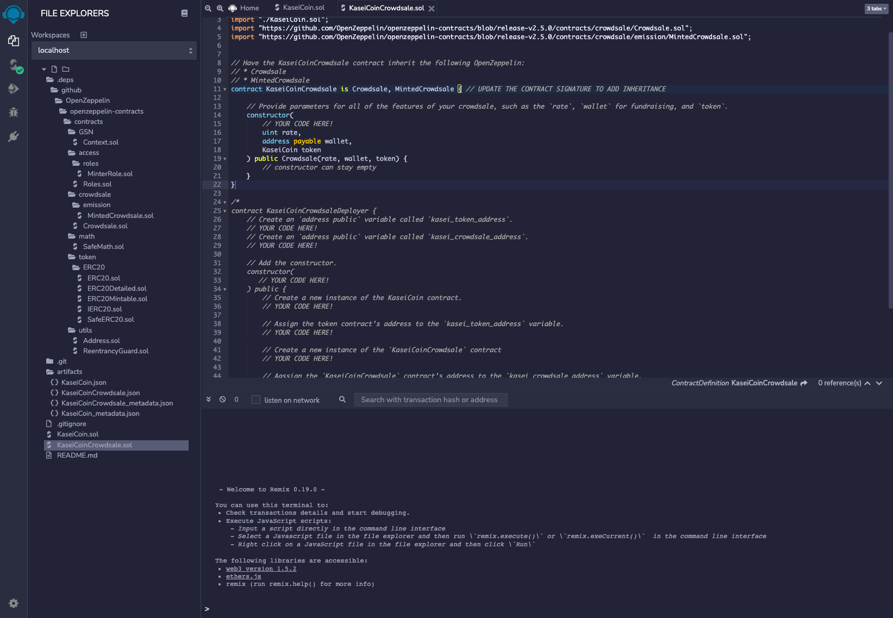
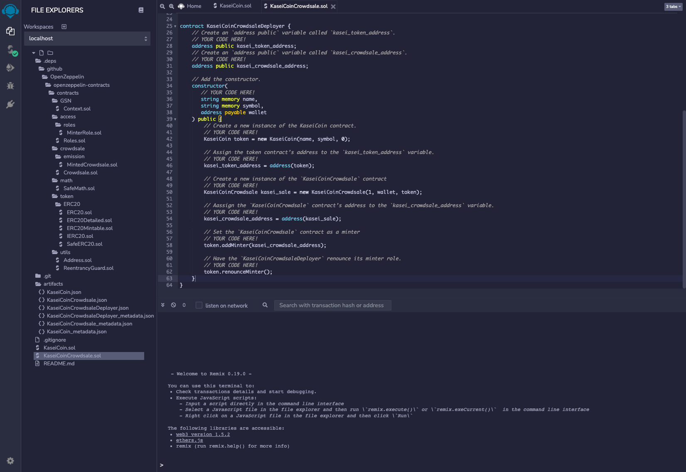
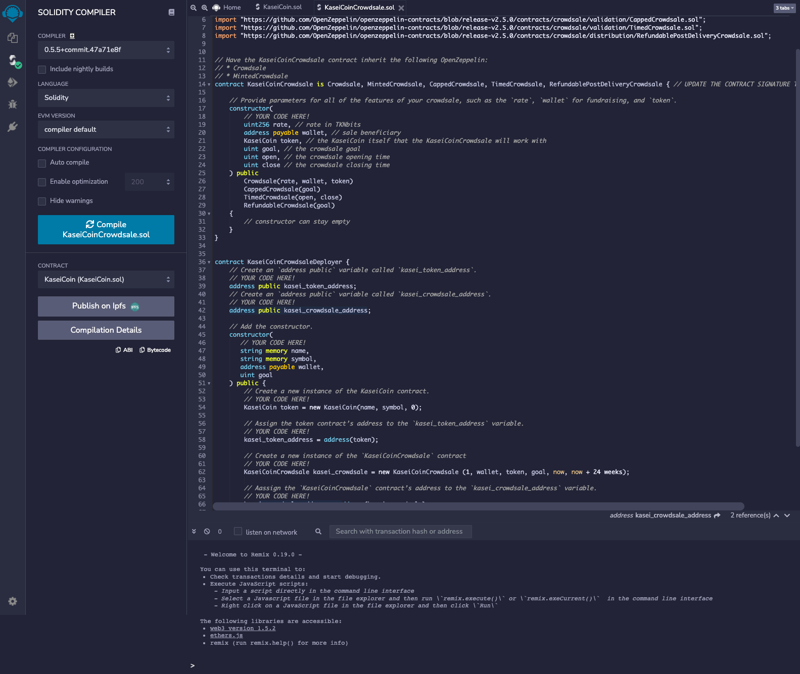

# KaseiCoin to Mars 🚀 (module_21_challenge)

Three solidity contracts: one for creating an ERC-20 token (KASEI), one for creating a crowdsale for the token, and one for deploying both the token and crowdsale.

---

## Technologies

- solidity 0.5.5
- openzepplin-contracts 2.5.0

---

## Evaluation Evidence

### 1. Compile the KaseiCoin contract

### 2. Compile the KaseiCoin Crowdsale contract

### 3. Compile the KaseiCoin Crowdsale Deployer contract

### 4. Deploy the KaseiCoin Crowdsale Deployer contract, purchase tokens from the crowdsale, and display the tokens in MetaMask

### Optional - Extend the Crowdsale using OpenZepplin libraries for Capped, Timed, and Refundable

---

## Contributors

---

## License

GNU GPLv3
